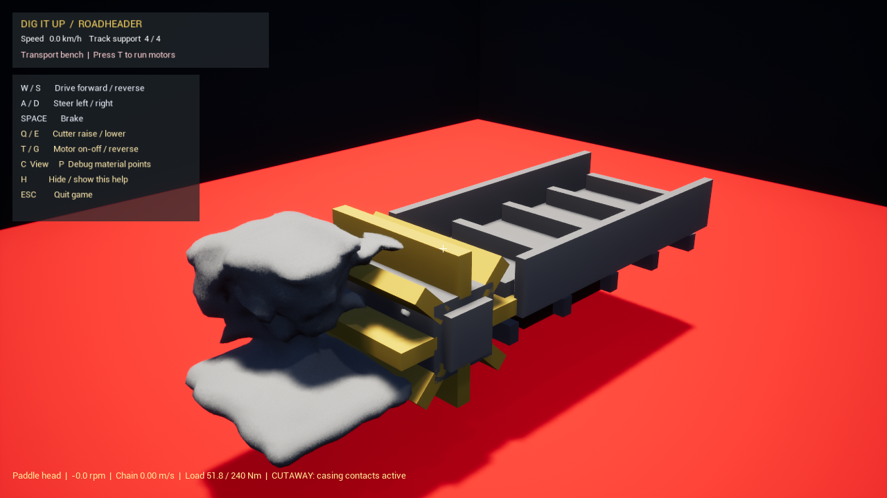
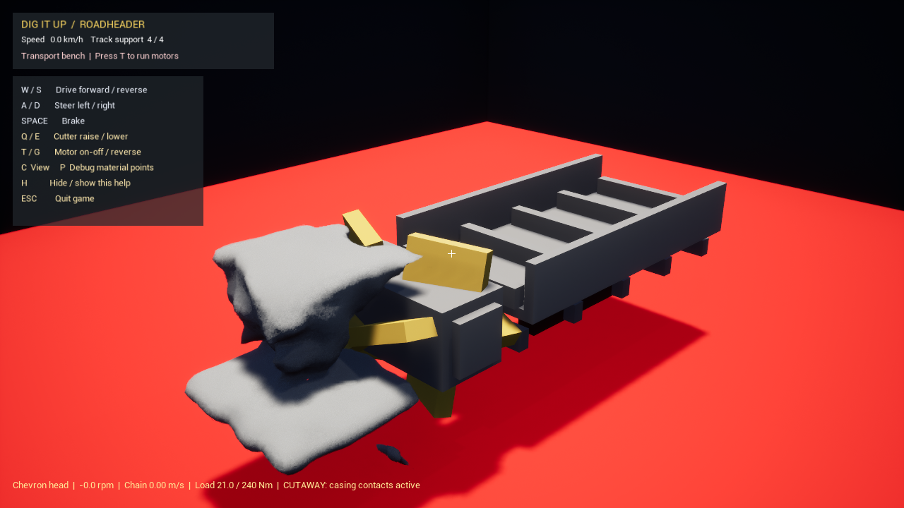
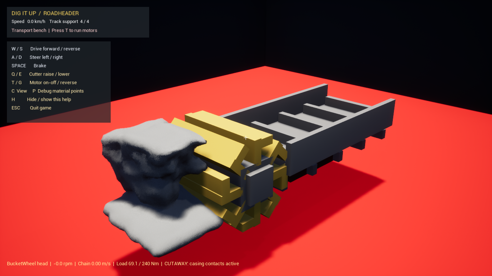
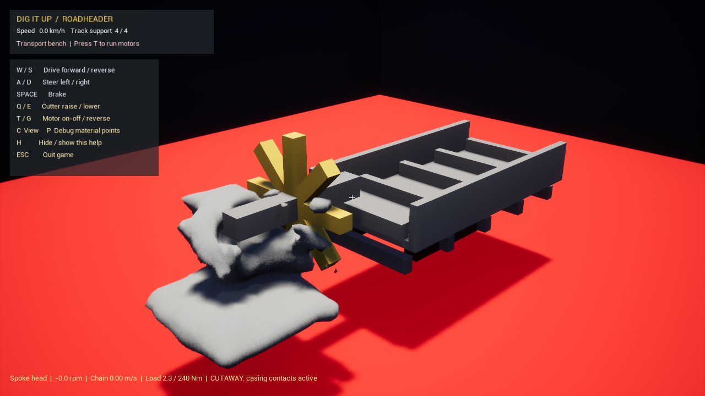
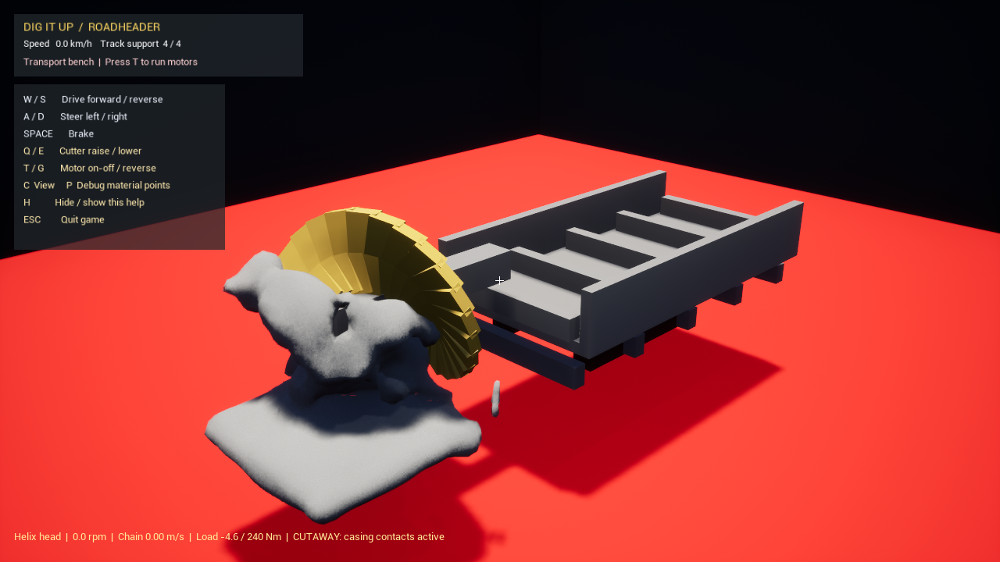
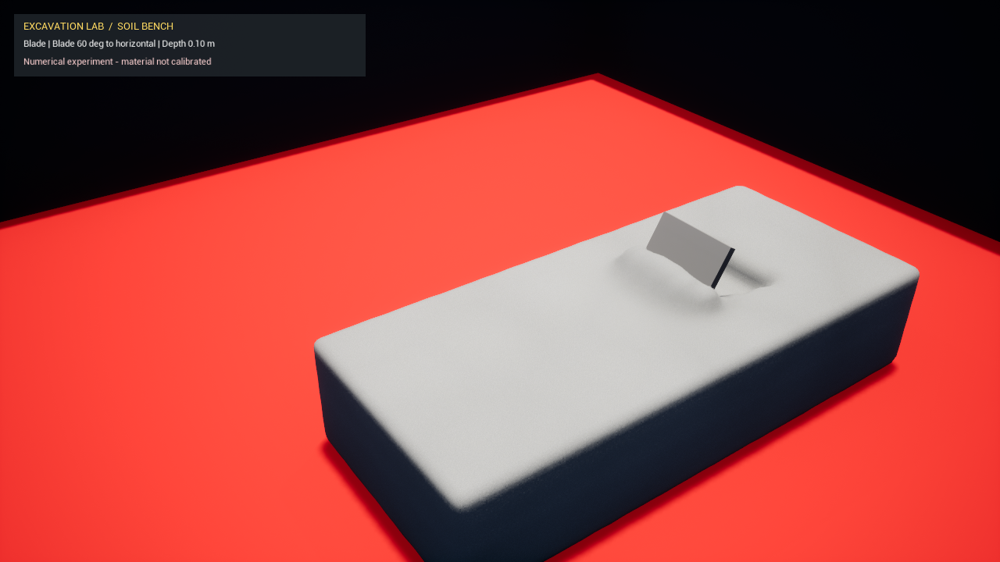

# 五种接触构型的实际引擎截图

这些是工程几何原型，来自本机UE画面；不是厂家产品复刻、设计渲染或AI生成图。前方送料夹具和罩壳在CUTAWAY视图中隐藏显示，但接触仍存在。截图为停机检查、旧材料预设，不能凭画面砂块判断新干砂模型；性能数据另见[试验结果](ExcavationLabResults.md)。

## Paddle 拨轮基线

## Chevron 错列斜板滚筒

## BucketWheel 八个L形兜砂单元

## Spoke 轴向辐条

辐条不是完整盾构刀盘，没有土仓及掌子面支护。

## Helix 24段倾斜叶片

叶片采用盒形近似，尚不是连续螺旋CAD曲面。轴向排列、板面倾角和旋向配合后，固定台运转出料6.40 kg，对应停机对照0 kg；该数值不代表完整螺旋掘进机效率。

## 独立平板土槽

这是新干砂预设的数值试验，刀角相对水平面定义。实物测力与土体标定尚未完成。

[返回总报告](ExcavationLabV2.md)
