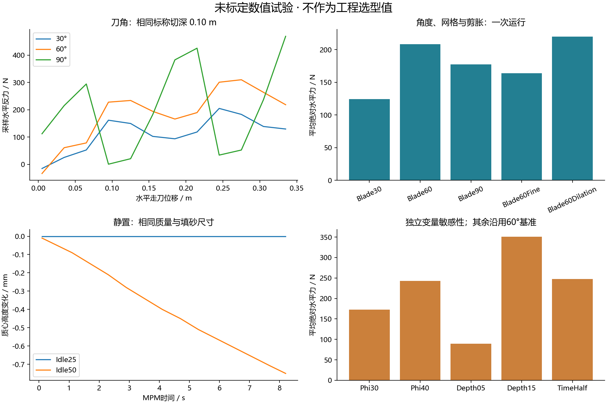
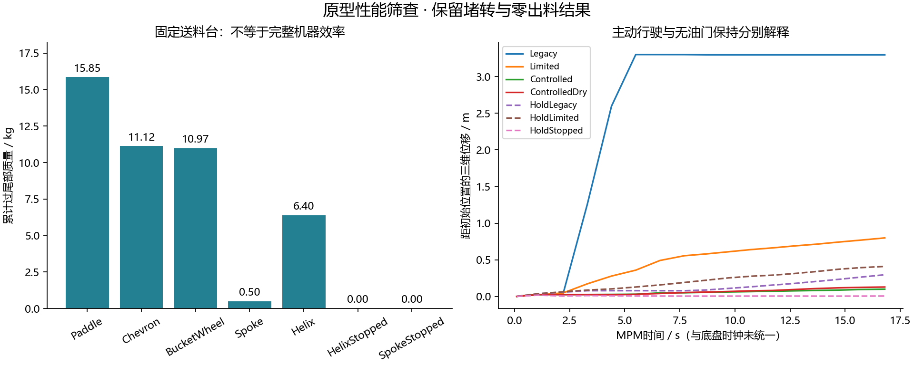

# 第二轮数值结果

由 `Tools/SummarizeExcavationLab.py` 从本机原始文件生成。每个工况为一次运行，无重复试验置信区间；小数为日志精度。本文所有数值均是未标定的数值试验结果。

## 小土槽

|工况|平均绝对水平力/N|水平走刀功/J|末态动能/J|末态质心高度/m|
|---|---:|---:|---:|---:|
|Idle25|0.00|0.00|0.00000|0.20000|
|Idle50|0.00|0.00|0.00006|0.19925|
|Blade30|124.50|43.35|0.00096|0.20088|
|Blade60|208.40|72.55|0.00167|0.20091|
|Blade90|177.23|61.54|0.01110|0.20007|
|Blade60Fine|163.74|57.49|0.00350|0.20063|
|Blade60Dilation|219.80|76.59|0.00266|0.20117|
|Phi30|172.65|60.17|0.00159|0.20085|
|Phi40|243.26|84.61|0.00206|0.20100|
|Depth05|89.53|31.15|0.00130|0.20032|
|Depth15|351.22|121.14|0.00354|0.20133|
|TimeHalf|247.50|86.03|0.00177|0.20114|
|Collapse|0.00|0.00|0.00008|0.09612|

将物理网格从 3.125 cm 加密到 2.5 cm，60°平均绝对水平力变化 +27.3%（以3.125 cm结果为分母）；默认内部子步也随网格变化。这不是纯网格误差隔离试验，尚不能宣布收敛。
固定 2.5 cm 网格、内部时间步减半，60°平均绝对水平力相对基准变化 +18.8%。这检查内部积分，尚未改变每次工具/底盘反馈间隔。

刀角试验保持标称切深和走刀速度一致；平均绝对力与有符号水平功是不同指标。未标定结果不提供真实砂的最优角。细网格仍只有一物质点/格；刀板厚度与最细网格同阶，接触和每格采样数量仍需检查。

## 固定送料台工作头

|构型|累计过尾部质量/kg|末态转速/rpm|末态转矩/N·m|
|---|---:|---:|---:|
|Paddle|15.850|16.41|1.54|
|Chevron|11.125|14.86|71.62|
|BucketWheel|10.975|0.00|501.75|
|Spoke|0.500|17.18|0.13|
|Helix|6.400|17.19|0.00|
|HelixStopped|0.000|-0.00|0.04|
|SpokeStopped|0.000|-0.00|0.04|

初始供料89.6 kg，固定送料台、强制送料机构，时长16.8 s。累计量按物质点身份去重，表示曾经过槽内再越过尾部，不保证已落入实体收集容器；不是有效开挖量、净流率或整机效率。停止对照也停止输送链。单一末态低转速不能代表全程堵转占时。

## 底盘与进给

|工况|末态三维位移/m|末态水平位移/m|末态速度/m·s⁻¹|累计过尾部质量/kg|
|---|---:|---:|---:|---:|
|Legacy|3.2970|3.2967|0.0003|0.000000|
|Limited|0.7989|0.7989|0.0045|0.000000|
|Controlled|0.0995|0.0970|0.0041|0.000000|
|ControlledDry|0.1287|0.1287|0.0023|0.000000|
|HoldLegacy|0.2959|0.2958|0.0084|0.000000|
|HoldLimited|0.4099|0.4097|0.0086|0.000000|
|HoldStopped|0.0059|0.0046|0.0014|0.000000|

Drive三组包含主动油门，不叫滑移量；有限牵引改变了油门到速度的映射，Controlled还改变切深，不能把三组位移差全部归因于抓地力。Holding三组无油门、持续制动、固定安装角；水平位移仍包含初始化后的支承调整，不等于稳态滑转率。

旧材料用于Drive的Legacy/Limited/Controlled及Holding，新干砂材料用于Soil/Sensitivity/Heads。ControlledDry另外检查快捷入口的组合模式，不能与Legacy的差异归因于单一底盘改动。完整沙箱出渣未通过的工况必须保留为失败。

|底盘工况|日志采样最大原始合力/N|日志采样最大滤后合力/N|
|---|---:|---:|
|Legacy|9100.5|15.0|
|Limited|820.9|14.6|
|Controlled|319.9|8.7|
|ControlledDry|4.6|9.9|
|HoldLegacy|254.5|13.6|
|HoldLimited|198.6|14.8|
|HoldStopped|139.6|3.6|

上表是稀疏日志采样最大值，不是真实峰值；原始值包含数值接触修正，未经实验标定。两列分别取最大值，不一定来自同一时刻。它们用于揭示反力传递处理，不应作为真实掘进机载荷。

先导失败与制动修正前的CSV在 `ExcavationLabEvidence/Pilots`，不计入本页最终工况数。它们用于保留失败与计量修正历史，不参与最终均值比较。

## 证据与门槛

本汇总包含 27 个工况。逐次采样质量误差≤0.001 kg，非有限物质点为0；这是软件健康检查，不代表力、能量或真实砂标定通过。

逐工况CSV、派生诊断与文件哈希位于本页同级的 `ExcavationLabEvidence`；原始日志与PNG保存在 `Saved/ExcavationLab`。源文件哈希记录汇总时源码，不应误解为每个历史运行都使用该最终源码；运行配置与保留的先导试验在主报告中说明。

[返回模型、文献和复现说明](ExcavationLabV2.md)

Unreal自动化：14项通过、0项失败、0项未运行；逐项状态见 `ExcavationLabEvidence/automation-summary.json`。测试包括共享GPU本构更新、旋转接触运动学与有限牵引/制动预算。
