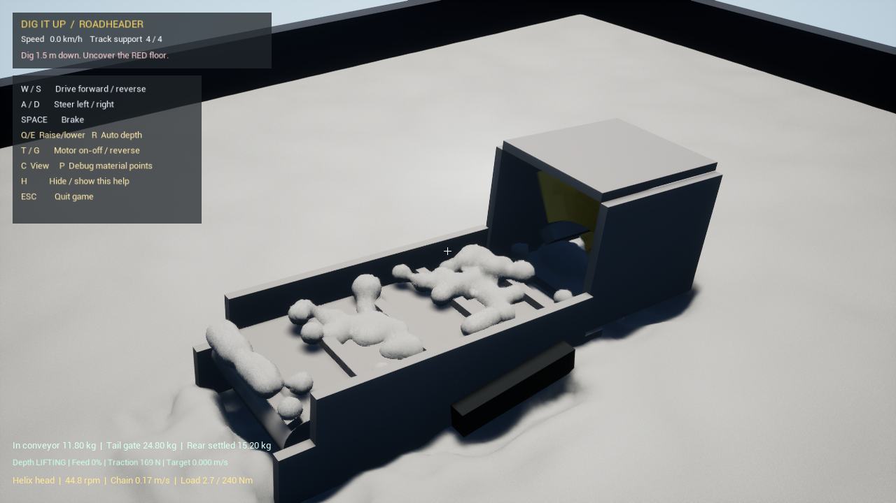
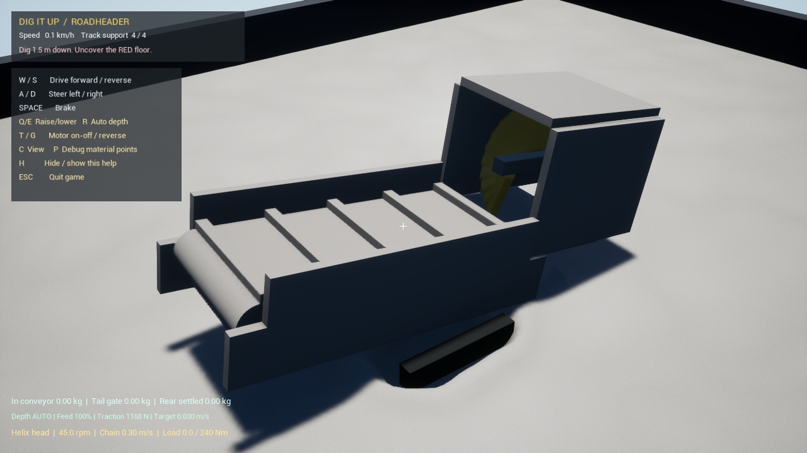

# 轴向分段螺旋掘进机：物理输送与整机稳定性验证

日期：2026-09-14。该构型用于当前 Unreal/MPM 干砂场景的机械研究。刀头、壳体、皮带和砂体通过同一组实体碰撞接触；没有粒子捕获、绑定、传送、删除或重新生成。它是 24 段盒形叶片近似出的单圈螺旋，不是连续 CAD 叶片，也不是厂家产品复刻。

## 结论

**5 cm 基准网格下，螺旋构型已经能稳定完成取砂、轴向输送、落到皮带和尾部出料；功能验收通过。数值收敛尚未建立，实物标定尚未开展。**

最终配置为：刀头 45 rpm、俯仰 −10°、螺旋接触摩擦系数 0.25、200 kg 缩尺机重、600 N 驱动力上限、0.20 m 深度斜坡、刀架最低 −20 cm、自适应进给与过载抬刀。配置见 [`Config/HelixRoadheader.json`](../../Config/HelixRoadheader.json)，双击仓库根目录的 [`PlayHelixRoadheader.cmd`](../../PlayHelixRoadheader.cmd) 可启动。

交互驾驶时 W/S 的目标速度为 ±0.08 m/s；自动验收仍使用 0.03 m/s 受控进给。过载抬刀可以暂停 W 的继续切入，但 S 始终保留后退脱困能力，实际加速度仍受履带 `μN` 牵引预算和砂体反力限制。

输入链修复后的 8.4 s 整机冒烟试验中，正向自动按键代理产生最高 +0.036 m/s 目标并净前进 0.0432 m；持续反向代理产生 −0.08 m/s 目标并净后退 0.4836 m。测试过程的牵引预算约为 1.10–1.17 kN，机身由有限履带力驱动，没有直接设置位移。

两次 60.1 s 同条件运行中，进入皮带的累计质量为 39.2 / 39.0 kg，越过尾轮 24.8 / 30.4 kg，尾部稳定沉积 15.2 / 13.6 kg，机身净推进 0.4856 / 0.4947 m。稳定沉积量差异为 10.5%，小于预先采用的 25% 重复性界限；两轮均没有后退超过 0.10 m。

## 验收矩阵

| 工况 | 时间/s | 进入皮带/kg | 越过尾轮/kg | 尾部稳定沉积/kg | 净推进/m | 结论 |
|---|---:|---:|---:|---:|---:|---|
| 同参数首轮（原始名 Probe） | 60.1 | 39.2 | 24.8 | 15.2 | 0.4856 | 通过 |
| 同参数复测 | 60.1 | 39.0 | 30.4 | 13.6 | 0.4947 | 通过 |
| 皮带停止、螺旋运转 | 60.1 | 2.6 | 0.0 | 0.0 | 0.3946 | 证明尾部出料依赖皮带 |
| 18 s 停刀并停带 | 60.1 | 0.0 | 0.0 | 0.0 | 0.1796 | 制动后无持续出料 |
| 30 Hz 耦合 | 45.4 | 29.8 | 12.2 | 3.2 | 0.6058 | 功能存在，定量值敏感 |
| Fine 网格 | 45.8 | 0.0 | 0.0 | 0.0 | 0.0322 | 未进入有效切削层 |

所有工况使用同一插件二进制和源码哈希。总 MPM 质量保持 60000 kg，记录质量误差为 0，非有限数为 0，携砂辅助计数为 0；几何扫描未发现超过 1 mm 的独立构件相交。完整机器可读验收结果见 [`acceptance.json`](acceptance.json)，各工况的时序 CSV、配置摘要和来源哈希在 [`evidence`](evidence) 中。

## 为什么早期不能出料

失败不是单一砂体参数造成的，而是一条连续的机械与控制问题叠加：

1. 早期 Helix 只是可见的几何原型，工作布局没有为轴向螺旋建立独立的壳体、槽底和皮带落点。
2. 轴和前端套环曾重复或静止，视觉转动与物理接触运动不完全一致。
3. 横向斗轮的罩壳和导料结构被直接套给轴向螺旋，出口与皮带存在高度/方向错位；过长的底板还会先铲到未扰动砂体，抬起整机。
4. 螺旋旋向最初错误，反力把砂推向前端。固定台正反转对照确认当前正向旋转才把砂送向皮带。
5. 原斗轮的 0.48 m 下压斜坡和 −6 cm 行程使螺旋长期位于有效砂层上方；改为 0.20 m 和 −20 cm 后，刀头能随实际推进达到切深。
6. 100 kg 机身无法稳定压住前端堆砂和切削反力。失败复测中虽取入 26.4 kg、举升 24.0 kg，机身却升到 1.802 m，刀架碰到下限，最终只有 0.4 kg 越过尾轮。改为 200 kg 后两轮机身末态高度为 1.551 / 1.529 m，尾轮出料恢复到 24.8 / 30.4 kg。
7. 履带承载识别曾因单个稀疏采样层中断，瞬时压缩弹簧力也会在振动中跨过零点，使整条履带的 `μN` 牵引预算突然消失。现在允许一个采样尺度的弱层桥接，并只对牵引预算使用 0.12 s 法向力滤波；实际砂体反力和竖向弹簧力仍保持原始值。
8. 螺旋有显著内部存料。它依靠叶片、罩壳和物料之间的差速滑移连续送料，不能用“刀头上还有砂”判断未工作；必须同时记录入口累计、当前壳内质量、皮带累计、尾轮越界和稳定沉积。

因此，早期现象包含砂体离散/支承敏感性，但主因是螺旋配套结构、旋向、切深控制和整机压载不匹配。仅提高砂体流动性会掩盖这些机械问题，并不能建立可信的工作路径。

## 对后续构型的约束

1. 先画完整物料路径：切削区、持料区、转接间隙、输送表面、排口和落料区必须连续，并逐段用累计质量验证。
2. 先做固定台正反转和停输送对照，再放到底盘上。无接触时的旋向判断不可靠；需要以有料时的轴向反力和出口质量确认。
3. 安装角、切深和执行器行程分开设置。扫描角度时保持实际刀尖深度一致，同时记录水平反力、竖向反力、机身抬升和净推进。
4. 机重、履带接地面积、土—履带摩擦与驱动力上限是构型的一部分。螺旋、斗轮和刀盘不能共用同一个未经核对的 100 kg 底盘后直接排名。
5. 不用单一“出料量”评价。至少记录取入质量、收集率、尾轮流率、内部存料、侧漏、首次出料时间、清空时间、扭矩、推进距离和最大后退。
6. 数值功能通过后仍要做网格和耦合步长检查。本轮 Fine 工况没有形成接触，30 Hz 与基准在 45 s 的稳定沉积量相差约 44.8%，所以还不能比较不同构型的精确效率或比能。
7. 圆盘/TBM 构型需要盘面开口、盘后土仓、排渣螺旋和推进反力系统；把圆盘装到自由履带上不构成盾构机验证。斗轮则需重新核对持料腔、卸料角与皮带落点。

## 当前模拟边界

Fine 网格末态如下。设备因网格尺度改变后的承载/牵引响应只前进 0.0322 m，刀架仍在 +22.8 cm，因此未进入砂层。该结果表明支承算法、履带—MPM 接触和自适应下压控制还需做分辨率一致化。

当前干砂参数仍未由真实砂样的堆积角、密度、剪切/贯入曲线、土—钢界面摩擦和履带沉陷数据反演。下一阶段应先建立小型砂槽标定，再做 5 cm、3.125 cm 和更细尺度下的相同实际轨迹对照；在这两个条件完成前，本页结论只支持“当前基准场景中物理工作链成立”，不支持实机产能、最优角度或构型优劣排名。

市场产品和论文对应的构型、工况与指标矩阵见 [`Docs/ExcavationDesignStudy.md`](../ExcavationDesignStudy.md) 和 [`Docs/ExcavationLabV2.md`](../ExcavationLabV2.md)。
