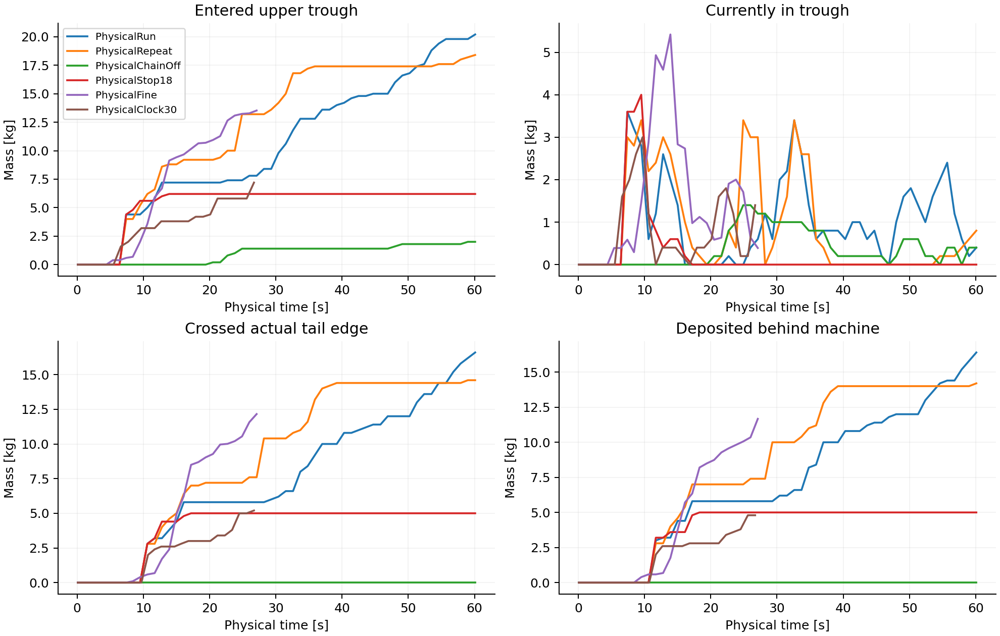
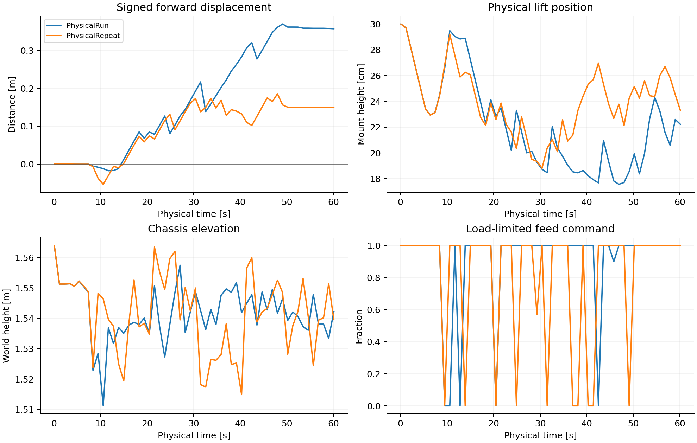
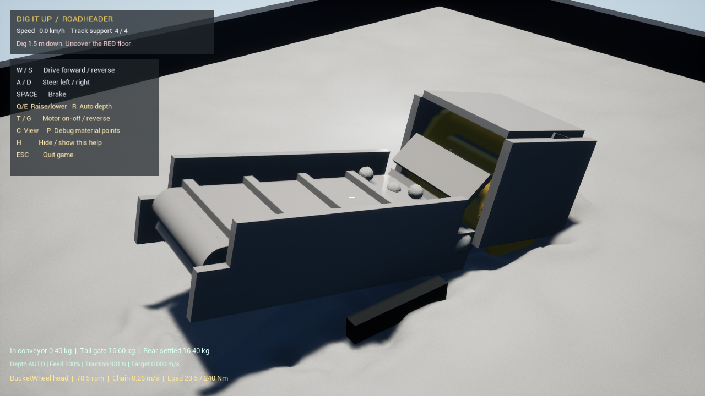

# 连续掘进与出料：结构、耦合和验收记录

日期：2026-09-13。开发起点：`bc01b3a`，分支 `codex/excavation-lab-v2`。

本文记录实际源码与本机数值试验，不是实机性能证明。最终受控工况使用 `Physical` 前缀，结果见本页验收表。开发过程原始记录位于 `Saved/TransportV3`，可用 `Tools/SummarizeTransport.py` 生成[工况台账](TransportV3/measurements.md)。台账包含不同构建、不同持续时间及失败方案，不能直接当成受控构型排名。

## 本轮验收结论

**41 项工况功能检查及 18 项自动化回归全部通过；数值收敛未通过；实物标定尚未开展。** 默认场景中，设备依靠原有 MPM 砂体与运动实体的接触完成取料、输送和机后排料。两次主运行沉积 16.4 / 14.2 kg，净前进 0.3573 / 0.1501 m，采样最大后退 1.75 / 5.34 cm。出料量相差 13.4%，推进距离仍有明显波动，不能据此给真实构型作精确排名。

| 工况 | 实际末报告 s | 曾入槽 kg | 机后沉积 kg | 净前进 m | 采样穿透峰值 mm |
|---|---:|---:|---:|---:|---:|
| 默认主运行 | 60.10 | 20.200 | 16.400 | 0.3573 | 1.482 |
| 相同设置重复 | 60.10 | 18.400 | 14.200 | 0.1501 | 1.305 |
| 输送带关闭 | 60.10 | 2.000 | 0.000 | 0.3943 | 1.444 |
| 18 s 停机 | 60.10 | 6.200 | 5.000 | 0.0297 | 1.517 |
| 30 Hz 耦合 | 26.70 | 7.200 | 4.800 | 0.0438 | 1.197 |
| 3.125 cm 细网格 | 27.10 | 13.525 | 11.670 | 0.1405 | 1.040 |

停带组尾部沉积为零；停机组在 22–60 s 的沉积保持 5.0 kg，工作头和皮带停止。各工况报告的总质量误差均为零、无非有限状态、无附着搬运，独立实体扫掠干涉检查通过。末时刻由首个达到设定时长的读回报告触发，表中使用实际报告时间，不能直接比较不同时长的末态总量。

| 共同物理时间 25 s | 机后沉积 kg | 相对默认主运行差异 | 5% 门槛 |
|---|---:|---:|---|
| 默认主运行 | 5.800 | 0.0% | 基准 |
| 30 Hz 耦合 | 4.255 | 26.6% | 未通过 |
| 3.125 cm 细网格 | 10.085 | 73.9% | 未通过 |

这是相同控制程序下的整机敏感性对照，包含土体、支承识别、执行器和运动轨迹的共同响应；每种精度只有一次对照，不能从差异中单独识别某个子模型的因果贡献，也不能因为一档更容易出料就判定它更真实。下一步应先完成材料/接触及履带支承标定，再重复网格、时间步和收集率/比能验证，之后才做构型排名。

- [18 项自动化回归结果](TransportV3/automation.json)，0 项警告、0 项失败；本机已完成源码构建和启动器路径检查。
- [逐项机器可读验收](TransportV3/acceptance.json)与[最终工况证据](TransportV3/evidence/)包含参数、源文件/二进制哈希和各段时序。
- [开发台账](TransportV3/measurements.md)和[失败/中间工况证据](TransportV3/development/)保留过程数据；中间源码并非全部归档，不将其伪装成最终版本的可重跑对照。







## 1. 原来的零出料不是一个原因

| 已定位的环节 | 本轮证据或检查 | 对后续设计的要求 |
|---|---|---|
| 刀头没有实际切入 | 固定进给的 RigHigh 中进料、抬升、入槽均为零 | 定义砂面、刀尖轨迹、最低护壳和底盘姿态；不能仅看旋转动画 |
| 抬升与接料不连续 | 降低刀头而保留高料槽的 Intake 方案仍无入槽；其他方案带起砂后大量返回刀头附近 | 将切削、持料、卸料、接料四段分别画出，计算完整转角中的开口与落点 |
| 运动零件相交 | 扫掠检查发现叶片与链条、接料板、回程护壳侧壁的毫米至厘米级干涉；这些工况被断言拒绝 | 检查整个周期和工作姿态，排除金属干涉后才讨论砂土参数 |
| 相连零件的速度不一致 | 原轮毂为静止方块，叶片在其周围旋转 | 同一刚性总成必须使用相同角速度；轮毂接触也计入驱动负载 |
| 回程段进入原状砂 | 降低输送槽的方案同时将下行刮板压进砂床 | 刀头应先清出容纳护壳的空间；上料段、回程段和地面之间分别校核 |
| 加罩壳也可能失效 | FreeGuard60 中护壳把机体顶高后，刀头几乎不再接触砂 | 不能只局部消除漏砂；必须核对整机最低点与真实切入深度 |
| 尾部存砂与计数漏记 | 粒子身份记录显示部分已入槽砂停在尾链轮下方；原 -65 cm 计数面会漏掉在 -62 cm 槽端立即下落的砂 | 区分上行料槽出口、回程卷入与机后沉积，保留原计数作对照 |
| 接触与诊断时刻不一致 | G2P 更新到子步末端后仍用中点工具位置；另有诊断遗漏工具随底盘平移、导料板遗漏升降速度 | 接触、运动速度与穿透统计使用同一完整运动规律，不能只核对旋转角 |
| 底盘与砂体时钟不同 | 旧异步全场景中 `worldT` 明显快于 `PhysicalTime` | 刚体运动、执行器位移与 MPM 必须使用同一个物理时间尺度 |
| 支承面混入抛起的砂 | 原算法平均邻域最高 8 个点，少量飞砂也会提高承载高度；增加从底部连续且具有足够占据密度的砂层检查，并设浮空点回归测试 | 物理粒子也要区分散料与承载土体，不能把最高点直接当接地面 |
| 反力和速度控制不匹配 | 旧 15 N 反力截断会掩盖负载；仅靠速度误差控制不能平衡持续外力 | 传递完整线冲量，控制器补偿外力，同时保留驱动力和摩擦上限 |

## 2. 此轮实现的物理边界

工作轮已改成六个有内外挡壁的料斗，并以随轴转动的端板封闭两侧。输送段补全连续承料带、回程带和圆柱形端部滚筒；仅有离散刮板时，砂可以从尾部落进链圈内部，再被下行段带回。带面用固定几何包络上的运动表面表示，这是连续皮带的接触边界；有限摩擦决定滑动，不会将砂绑定到带面。端部使用圆柱接触，而不是用方块假装滚筒。带面摩擦、滚筒扭矩和刮板转弯扭矩均计入有限驱动负载。

还需区分**刀尖切深**和**容砂腔的有效进料深度**。在本轮几何、底盘高度 1.58 m、俯角 -14° 下，安装高度 20 cm 时，轮心约为 1.7053 m；容砂腔截面最远角点半径约 0.221 m，其最低轨迹约 1.4843 m。砂面名义高度 1.5 m，而 5 cm 网格最上层初始物质点中心在 1.475 m。也就是说，刀尖已接触砂，但主要容砂空间几乎够不到初始物质点。安装位置降低至 16 cm 后，该最低轨迹降为约 1.4443 m。这是初始平床与理想刚性姿态的几何计算，实际装料还会受到扰动、转速、底盘沉陷和网格影响。

卸料也不是“转得越慢越稳”。[KWS 的厂家说明](https://www.kwsmfg.com/resources/ask-the-experts/centrifugal-vs-continuous/)区分了低速重力卸料与高速离心卸料。本项目借用这一机理作转速对照，并未照搬其设备参数。以容砂半径 0.20 m 估算，30 rpm 的 `ω²r/g≈0.20`，80 rpm 约为 `1.43`；相应的切向速度约 0.63 与 1.68 m/s。必须将释放位置、速度、重力落差和接料距离一起设计，不能仅依据外观选转速。实际转速仍由电机扭矩上限与接触负载决定。

- 刀头、挡板、导料板、输送刮板均用可见实体接触原来的 MPM 物质点；掘进机没有启用挖掘机的附着搬运。没有为出料删除、重新生成、捕获或按轨迹移动砂。
- `SandFeedRig` 仅是固定高度的诊断进给架：移动的是整台可见机械，不是砂。它仍使用完整沙箱，但不能替代自由底盘验收。
- `SandSynchronous` 同步 MPM 与刚体时间，默认耦合步长 1/60 s，可用 30/60/120 Hz 对照。它是显式分区耦合，不是迭代收敛的强耦合。
- `SandDirectReaction` 累计所有非履带碰撞体的网格接触及粒子修正冲量，将反力施加到底盘；不再使用旧 15 N 截断。当前仍将合力加在质心，且原有地形随动俯仰/侧倾辅助仍在使用；尚未实现完整角动量守恒的自由六自由度整机。
- 牵引使用有限的驱动力及 `μN` 预算。接地高度来自物理粒子，不再由显示等值面控制。承载仍是经验压缩弹簧，履带没有逐履刺接触或经过实测标定的沉陷—剪切模型。
- 工作布局中的质量与动力是设计假设，尚未由材料密度和制造 BOM 反算。碰撞体的加厚板和相交分块不能直接求和当制造体积；100 kg 不能理解为图中全部厚板实心钢制时的真实重量。不能将其称为某厂家的实测机器。干砂采用现有 DryCorotated 参数，未通过人为增加黏聚力让砂“粘”在刀头上。

### 为什么单次出料仍不够

固定深度的 `Free80` 曾达到机后沉积 23.2 kg、前进 0.1992 m，但后续 `FinalRun` 和 `FinalRepeat` 的有符号位移分别为 -0.1770 m、+0.0452 m。因此该方案未通过自由推进的重复验收；不能挑选一次成功运行作为最终结果。输送路径已经接通，切入与牵引匹配仍不足。

`SandAdaptiveFeed` 增加实际执行器控制：使用所有非履带接触的水平合反力与有限牵引预算的比值，滤波只作用于传感信号，不作用于施加给底盘的真实反力。负荷过高或出现后退时，暂停进给并以最大 4 cm/s 抬头；恢复后最大 1.5 cm/s 接近目标。目标切深随实际前进逐渐增加，并补偿底盘高度变化。Q/E 可接管升降，R 恢复辅助；停止工作时保持自动升降位置。

`SandDenseSupport` 对支承采样的竖向层检查连续占据密度，排除与下方砂床不连续的少量飞砂。它仍是经验支承面识别，更新频率随物质点读回约为 10 Hz；尚未替代为土体接触压力积分，也不适合直接验证洞穴顶板或架空结构。

该控制是针对初始平整砂床的作业辅助，不是未知地形的自主导航。升降使用有限速度的理想位置执行器，液压缸有限推力、行程柔性与完整能耗尚未建模。转子、皮带和底盘仍保留有限驱动/牵引约束。最终受控运行结果与是否通过验收需见本页结果表，不能由这段实现说明推断。

### 数值修正和统计修正必须分开

中间的 `AdaptiveRun/Repeat` 在约 60 s 达到 14.2/18.0 kg 沉积和 0.2878/0.6139 m 净前进，停带组为零出料。但该轮穿透统计没有包含底盘平移，且 G2P 接触仍用了中点工具位置，不能把其中 3.316 mm 等峰值直接解释为纯粹的实体穿透。中止剩余对照后，改为粒子末位置对应工具末位置；诊断从同一个初始碰撞状态推到末时刻，导料板也补齐升降速度。随后重新运行独立的 `Physical` 组；旧出料数据保留为开发记录，不替代最终验收。

## 3. 各指标证明什么

| 指标 | 定义与限制 |
|---|---|
| intakeSeenKg | 曾进入刀头邻域的身份累计；含受扰动但未挖出的砂，不能当净开挖量 |
| liftedKg | 进入邻域后曾高于初始砂面 3 cm；并不保证进入输送槽 |
| troughSeenKg / troughKg | 曾进入有效上行料槽 / 当前仍在槽内的质量 |
| outletKg | 保留原 -65 cm 尾部平面及高度窗计数；可能漏记迅速下落的砂 |
| tailCrossKg | 已入槽砂向后越过实际 -62 cm 槽端，高度位于上行出口窗内 |
| rearSettledKg | 越过实际槽端后，在机后、回程罩下方且速度低于 0.15 m/s 的身份累计；为数值沉积判据，不等于永久静止 |
| signedAdvanceM | 沿初始场景 +X 的有符号位移，避免把后滑距离当成前进量 |
| massError / nonfinite / carried | 全局质量、数值有限性、附着搬运检查；通过这三项不能单独证明物理正确 |

移动底盘的相对平面可能扫过粒子，因此必须组合入槽身份、真实出口、机后沉积与固定架对照，不能只统计机后所有砂。全沙箱初始已有大量砂位于机后。

## 4. 后续构型复用顺序

1. **先定义任务。** 指定干砂状态、目标切深、进给速度、机重、驱动能力、出料去向；区分构型筛选与厂家实机复现。
2. **先画物料路径再画外壳。** 标出工作头旋向、持料腔、卸料角、接料面、上行段、回程段与出口。逐角度检查重力会把砂带到哪里。
3. **做运动扫掠检查。** 使用和 MPM 完全相同的碰撞几何，检查所有转角、升降行程、俯仰角及履带位置。固定连接的零件必须具有一致的刚体速度。
4. **核对最小特征与网格。** 物质点不是实砂粒，显示体素也不是物理网格。薄板、窄隙、相向运动段若只有一格左右，不能直接解释堵塞、泄漏和效率。
5. **从无初始穿插的状态启动。** 先让转子建立转速，再由真实执行器逐步接近砂面。预先把大块实体埋入砂中会污染启动载荷。
6. **固定架分段验证。** 分别确认取料、抬升、接料、输送和落料；至少做输送链停转、全停止、反转或清堵对照。夹具提供的反力必须明确标记。
7. **恢复自由底盘。** 同步时钟、施加反力、保留有限牵引；检查有符号推进、后滑、沉陷、离地及电机堵转；将切深和进给与实际支承/牵引余量联动，而不是开机直接压到固定深度。不要用任意锁车、无限动力或反力截断修饰结果。
8. **最后做可比性验证。** 同一初态与控制程序下重复，改变物理网格、内步长与耦合步长，比较时序而非只比较最终截图。固定架通过不能替代自由驾驶通过。

### 换构型时哪些能复用，哪些不能照搬

| 可复用的实现或检查 | 必须为新构型重新确定 |
|---|---|
| 同步时钟、整内步、完整线反力、有限驱动、身份追踪和各段质量计数 | 刚体连接、运动轴、驱动广义力及装配扫掠范围 |
| 固定架→自由底盘→停带/停机→重复→分辨率对照的流程 | 工作头、入口、输送能力与尾部接收空间的匹配 |
| 依据实际牵引预算调进给、过载主动减小切入 | 控制阈值、升降行程、目标切深、机重及支承面积 |
| 同一土样的密度、φ、ψ、土—钢摩擦和单刀标定程序 | 土样级配/密实度适用范围；不能把经验履带 μ 直接等同 tanφ |

本轮 80 rpm、-14° 和安装高度 16 cm 只属于这套轮斗/皮带几何。螺旋构型需重算旋向、螺距、轴向送料和槽壳间隙；圆盘构型需同时设计盘面开口及盘后的收集/排料；轮斗需验证持料腔、卸料角和接料落点。不能仅替换前端外观，沿用一条未核对的排料通道。实际比较还应记录净收集/切出比例、比能和真实带速对应的滑移，但当前数据不足的指标应保持空白。

## 5. 真实干砂验证仍需要什么

数值优化不能替代材料与设备标定。下一阶段应依次获得：堆积/塌落试验的时序与堆形，直剪或三轴的峰值/残余强度和体变，单刀不同深度/角度/速度的水平及竖向力，履带沉陷与牵引—滑移曲线，最后才是整机吞吐与比能。

挖掘机旧版仍有子网格携砂辅助，不能把其较容易挖掘直接解释为构型更优。后续与掘进机比较时，应关闭该辅助或明确分组，并统一材料、运动时钟、反力处理及质量/动力的比较口径。

目前的模型仍有未标定的弹性、耗能、接触及支承参数；原求解器的 4 m/s 速度保护上限仍保留，尚未单独统计触发次数，不能宣称完整能量守恒；密度与应变状态演化、剪胀、网格跨薄壁动量混合和全刚体角动量也需要单独检查。应沿用 [ExcavationLabV2](ExcavationLabV2.md) 中的来源与标定空表，不能把“运行稳定、能出料”写成“已经准确模拟真实干砂”。

## 6. 启动与复现

双击仓库根目录的 `PlayRoadheaderTransport.cmd`。此入口读取 `Config/RoadheaderTransport.json`，使用本机已构建的 UE 5.8 Editor；旧的打包预览入口不包含本轮修改。T 开启工作头和皮带，W 向前进给；Q/E 接管升降，R 恢复深度辅助，C 切换视角，P 显示原有 MPM 物质点。反转/清堵本轮未验收；需要换向时先 T 停机、G 换向，再 T 启动，现有简化离合不能当作真实换向瞬态模型。辅助针对初始平床，其他地形和深挖仍需手动控制与重新验证。

本次材料设定为 φ=35°、c=0 Pa、工具摩擦系数 0.5、阻尼 0.15/s、剪胀角 0°；履带经验摩擦系数另取 0.6。Balanced 物理网格为 5 cm，30 万物质点；外层 60 Hz、内层 600 Hz。Fine 为 3.125 cm、1,228,800 个物质点、内层 900 Hz；其网格与稳定内步长一起加密，不能将二者的差异解释为纯粒径效应。物质点代表连续体体积，不是真实砂粒；稀疏出料在表面重建中显示成团块，不意味着使用了有黏聚力的砂。

```powershell
# Existing ASCII junction avoids the Windows UE non-ASCII PCH path issue.
& D:/UE_5.8/Engine/Build/BatchFiles/Build.bat SandExcavatorEditor Win64 Development -Project=D:/UEProjects/DigItUp/SandExcavator.uproject -WaitMutex -MaxParallelActions=4
& Tools/TestRoadheaderAcceptance.ps1 -Prefix Physical
& Tools/TestExcavationLabAutomation.ps1
$env:PYTHONUTF8='1'
python Tools/ValidateRoadheaderAcceptance.py --prefix Physical
python Tools/SummarizeTransport.py
& "$env:LOCALAPPDATA/Programs/Python/Python311/python.exe" Tools/PlotTransport.py PhysicalRun PhysicalRepeat PhysicalChainOff PhysicalStop18 PhysicalFine PhysicalClock30
```

验收使用同一二进制与同一源文件版本。主运行、重复、停带和停机观察 60 s，自动进给指令在 9–50 s；停机组在 18 s 停止工作。网格/耦合步长对照观察至 26 s，并在共同物理时间 25 s 比较累计沉积。采样频率约 1 Hz，穿透及退距峰值是采样峰值；不等于每个内部子步的绝对极值。穿透检查使用提交给 MPM 的碰撞体预测末位姿，不覆盖随后 Chaos 刚体更新与该预测之间的全部分区耦合误差。

功能门槛为主运行和重复各沉积至少 5 kg、净前进至少 0.10 m、采样最大后退不超过 0.10 m，并在 12–25 s 增加至少 2 kg 沉积；两次累计沉积差异不超过较大值的 25%。停带要求沉积降低至少 80%；停机后驱动停止且 22–60 s 沉积增加不超过 0.6 kg。细网格也应出料至少 2 kg。另检查质量、有限性、零附着搬运、独立实体干涉、采样穿透不超过 2.5 mm、同步时间与整内步。

这些是本项目预先设定的功能检查，不是行业标准。25 s 网格/耦合步长差异另以 5% 作数值收敛检查，物理标定单独标记；功能通过不能覆盖后两项失败。实际计算速度低于模拟时钟速度。本机主运行 60.1 s 物理时间约耗时 175 s，Fine 的 27.1 s 约耗时 394 s（含启动/退出）；这不是实时模式。
